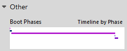

# Boot trace phases

Wpa.exe boot analysis

If the Boot Phases graph is unavailable, use the below information to find the durations of each boot phase.

Alternativley, the [ETLReports](https://github.com/itoleck/ETLReports) tool can be used to create a .csv file and .png file of the boot phase information. The Windows Performance Toolkit application, xperf.exe can also create an .xml report using actions. See **xperf.exe -help processing** for more information.

.\etlreports.exe --infile:<.etl file path> --processor:bootphases --outfile:<output directory>

Example ETLReports output:

 

|       **Phase**      | **Normal Duration** | **Start of boot phase** | **End of boot phase** | **Notes** |
| ---------------------|---------------------|-------------------------|-----------------------|-----------|
| Pre-Session Init     | 0-9s | Beginning of boot trace | First Smss.exe process starts  | This boot phase starts after the BIOS/UEFI ends and the kernel loads. This phase should only take low single digit seconds to complete. Providers to check in this phase are Microsoft-Windows-CodeIntegrity, Microsoft-Windows-Kernel-Boot and Microsoft-Windows-Kernel-PnP|
| Session Init         | 0-12s | First Smss.exe process starts  | Second Csrss.exe process starts   or all Microsoft-Windows-Subsys-SMSS/smss:LoadSubsystem/win:Stop(s) end  | This phase should only take single digit seconds to complete. Providers to check in this phase are Microsoft-Windows-CodeIntegrity, Microsoft-Windows-Kernel-PnP, Microsoft-Windows-Services and Microsoft-Windows-Services-Svchost|
| WinLogon Init        | 10-60s | Second Csrss.exe process   or first LogonUI.exe starts   or all Microsoft-Windows-Subsys-SMSS/smss:LoadSubsystem/win:Stop(s) end  | Process/explorer.exe Start Time (s)   or Microsoft-Windows-Winlogon/UserShellLaunch/win:Info  | This is usually the longest of the boot phases as it encapsulates the starting of sessions, services and any Group Policies/scripts. A performant mean time for this boot phase is ~30 seconds. Providers to check in this phase are Microsoft-Windows-Services, Microsoft-Windows-Services-Svchost, Microsoft-Windows-GroupPolicy, Microsoft-Windows-TaskScheduler and Microsoft-Windows-Winlogon |
| Explorer Init        | 0-6s | Microsoft-Windows-Shell-Core/Explorer_InitializingExplorer/win:Start  or Process/explorer.exe Start Time (s)  | Microsoft-Windows-Shell-Core/Explorer_InitializingExplorer/win:Stop  or last LogonUI.exe process ends  | This boot phase starts after a user has logged on the machine. The shell(Explorer) and any startup applications start in this phase. This phase should only take single digit seconds to complete. Providers to check in this phase are Microsoft-Windows-Shell-Core and Microsoft-Windows-TaskScheduler|

Overall hardware resources like CPU, storage, memory should also be analyzed during a boot/logon trace.
